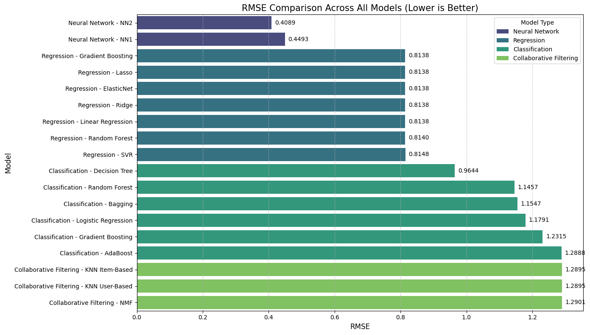

# Recommendation Systems
An investigation and comparison of recommendation systems and techniques.

## Overview
This project explores and compares various recommendation system approaches on a course enrollment dataset. The goal is to identify the most effective techniques for recommending educational content to users based on their preferences and behaviours.

This project was done as the 'Capstone' Project for the IBM Machine Learning Professional Certificate.

## Techniques Implemented
#### Content-Based Filtering
- User Profile Approach: Creates user preference vectors and matches with course features
- Course Similarity Approach: Recommends courses similar to those a user has taken
- Text Representation Methods: Bag-of-Words, TF-IDF, and Word Embeddings

#### Unsupervised Clustering-Based Recommendations
- K-Means Clustering: Groups users by preference patterns
- DBSCAN: Density-based clustering approach
- Hierarchical Agglomerative Clustering: With various linkage and distance metrics

#### Collaborative Filtering
- User-Based KNN: Recommends items based on similar users' preferences
- Item-Based KNN: Recommends items similar to those a user has liked
- Non-Negative Matrix Factorization (NMF): Decomposes the user-item matrix into latent factors

#### Hybrid Approaches
- Regression Models: Linear Regression, Ridge, Lasso, ElasticNet, Random Forest, Gradient Boosting, SVR
- Classification Models: Logistic Regression, Decision Tree, Random Forest, Gradient Boosting, AdaBoost, Bagging
- Neural Networks

## Dataset
- 31,000+ users
- 125 courses
- User-course interactions (enrollments + ratings)
- Course metadata (titles, descriptions, genres)

## Key Findings
| Model Type | Mean | Min | Max | Count |
|------------|------|-----|-----|-------|
| Neural Network | 0.429125 | 0.408922 | 0.449327 | 2 |
| Regression | 0.813985 | 0.813813 | 0.814788 | 7 |
| Classification | 1.160703 | 0.964361 | 1.288799 | 6 |
| Collaborative Filtering | 1.289722 | 1.289513 | 1.290139 | 3 |

### Visual Comparison


## Installation

```bash
# clone the repository
git clone https://github.com/yourusername/recommendation-systems.git
cd recommendation-systems

# install dependencies
pip install -r requirements.txt

# DOWNLOADS
nltk.download('punkt_tab')
nltk.download('stopwords')
nltk.download('averaged_perceptron_tagger_eng')
```

## Usage

The project is organized as Jupyter notebooks:

1. `EDA_FE_content.ipynb`: EDA, Feature Engineering, Content-Based Recommender
2. `clustering.ipynb`: Unsupervised Clustering-Based Recommenders
3. `collaborative_filtering.ipynb`: Collaborative Filtering Recommenders using `Suprise`
4. `hybrid_recommenders.ipynb`: Neural Network, Regression, & Classification Recommenders

## Acknowledgments

- IBM for providing the educational dataset and delivering the course
