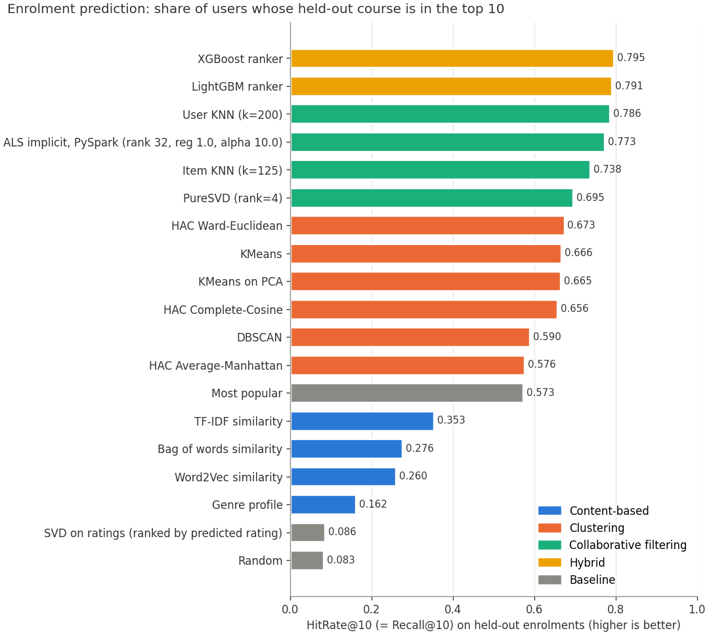
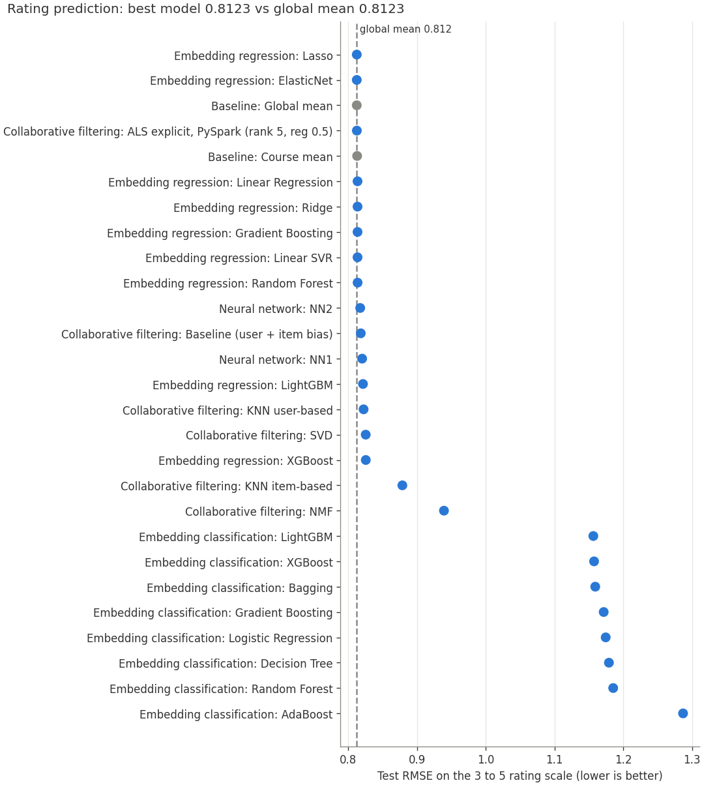

# Recommendation Systems

A comparison of course recommendation methods on the IBM course enrolment dataset. This was the capstone project for the IBM Machine Learning Professional Certificate.

## Summary

The dataset has 233,306 enrolments from 33,901 users across 126 courses. Each enrolment has a rating of 3, 4 or 5.

Models are evaluated on two tasks:

1. **Rating prediction.** Predict the rating a user gives a course. Scored by RMSE.
2. **Enrolment prediction.** Hide one course each user took, rank all the courses they have not taken, and check whether the hidden course is in the top 10. Scored by HitRate@10 and NDCG@10.

Main results:

- The ratings carry no signal. They are split almost evenly between 3, 4 and 5, and permutation tests find no user effect (p = 0.82) and no course effect (p = 0.54). No rating model beats predicting the global mean.
- Enrolments are predictable. The best model, an XGBoost ranking model, puts the hidden course in the top 10 for 79.5% of users. Recommending the most popular courses does this for 57.3%.
- Collaborative filtering is the strongest single approach. Content-based recommenders score below the popularity baseline.



## Data

| | |
|---|---|
| Enrolments | 233,306 |
| Users | 33,901 |
| Courses with enrolments | 126 (307 in the catalogue) |
| Rating split (3 / 4 / 5) | 33.4% / 33.4% / 33.2% |
| Users with a single enrolment | 8,320 |
| Share of the user x course matrix filled | 5.5% |

The notebooks also use course genres and course titles and descriptions. All files are downloaded from IBM's course storage on first use and cached in `data/`.

## Evaluation

The splits and metrics are defined once in `recsys/` and shared by every notebook. Within each task, every model is scored on the same test rows.

### Rating prediction

- **Split:** a random 80/20 split over enrolments, with seed 123. The data has no timestamps, so a temporal split is not possible.
- **Tuning:** hyperparameters are chosen by cross-validation on the training set, or on a 10% validation slice of it. The test set is only used for the final score.
- **Metric:** RMSE on the test set, on the original 3 to 5 scale.
- **Baseline:** the mean rating of the training set.

### Enrolment prediction

- **Split:** leave-one-out per user. For each of the 25,581 users with at least two enrolments, one random enrolment is held out as the test course. All other enrolments are training data.
- **Tuning:** a second held-out enrolment per user, taken from the training data, is used as a validation set. All hyperparameters are chosen on it, and the ranking models are trained on it. The test set is only used for the final score.
- **Candidates:** every course the user has not taken in the training data, out of 126.
- **Metrics:** HitRate@10 is the share of users whose test course is in the top 10. With one test course per user it equals Recall@10. NDCG@10 also gives more credit when the test course is ranked higher.
- **Baselines:** random ranking, and ranking by course popularity.

## Results

All figures are test-set results. "Mean" is the average over the models in a family. "Best" is the single best model.

### Enrolment prediction

| Family | Models | Mean HitRate@10 | Best HitRate@10 | Best NDCG@10 | Best model |
|---|---|---|---|---|---|
| Hybrid | 2 | 0.793 | 0.795 | 0.565 | XGBoost ranker |
| Collaborative filtering | 4 | 0.748 | 0.786 | 0.563 | User KNN |
| Clustering | 6 | 0.638 | 0.673 | 0.430 | Hierarchical, Ward linkage |
| Content-based | 4 | 0.262 | 0.353 | 0.178 | TF-IDF similarity |
| Baseline: most popular | 1 | | 0.573 | 0.341 | |
| Baseline: random | 1 | | 0.083 | 0.038 | |

- The two ranking models combine seven collaborative, content and popularity features. They beat user KNN by a small margin. The content features account for about 2% of their total gain.
- A weighted blend of item KNN and a genre content score was also tested. Validation chose a content weight of zero, so it is not counted as a hybrid.
- The clustering setup with the best silhouette score (hierarchical, average linkage) gave the weakest recommendations in its family. It put 98% of users in one cluster.
- Ranking courses by a rating model's predicted rating (Surprise SVD) scores 0.086, the same as random.

### Rating prediction

| Family | Models | Mean RMSE | Best RMSE | Best model |
|---|---|---|---|---|
| Baseline: global mean | 1 | 0.8123 | 0.8123 | |
| Embedding regression | 9 | 0.8154 | 0.8123 | Lasso |
| Neural network | 2 | 0.8187 | 0.8173 | NN2 |
| Collaborative filtering | 6 | 0.8493 | 0.8124 | ALS, PySpark |
| Embedding classification | 8 | 1.1837 | 1.1563 | LightGBM |

The best models tie with the baseline because regularisation shrinks them to predicting the mean. The classifiers can only predict whole ratings, and their accuracy is at chance level (33%).



## Models

**Content-based** (`EDA_FE_content_rec.ipynb`). A genre profile recommender, and course similarity recommenders using bag of words, TF-IDF and Word2Vec representations of course titles and descriptions.

**Clustering** (`clustering.ipynb`). Users are clustered by the genres of the courses they took, and each user is recommended the most popular courses in their cluster. K-means, K-means on PCA components, DBSCAN, and hierarchical clustering with Ward, complete and average linkage.

**Collaborative filtering** (`collaborative_filtering.ipynb`, `als_pyspark.ipynb`). For ratings: a user and course bias model, user KNN, item KNN, NMF and SVD from the Surprise library, and explicit ALS. For enrolments: user KNN, item KNN, PureSVD and implicit ALS.

**Neural network and embedding models** (`neural_embedding_models.ipynb`). NN1 is a matrix factorisation network with user and course embeddings. NN2 adds dense layers and dropout. The embeddings learned by NN1 are used as features for 9 regression models (linear, ridge, lasso, elastic net, random forest, gradient boosting, XGBoost, LightGBM, linear SVR) and 8 classification models (logistic regression, decision tree, random forest, bagging, AdaBoost, gradient boosting, XGBoost, LightGBM). These models only use user and course ids, so they are collaborative models.

**Hybrid** (`hybrid_recommenders.ipynb`). LightGBM and XGBoost ranking models trained with a LambdaRank objective. Their features are item KNN, user KNN and PureSVD scores, a genre profile score, a TF-IDF similarity score, course popularity, and the number of courses the user has taken.

### PySpark

`als_pyspark.ipynb` repeats the exploratory analysis in Spark SQL and trains ALS with Spark MLlib. It uses the same splits as the other notebooks, so its results appear in the same tables.

## Update history

On 29 September 2026 the project was revised. Bugs were fixed, the code was cleaned up, ranking metrics and a shared evaluation setup were added, and the model rankings changed as a result.

## Project structure

```
notebooks/
  EDA_FE_content_rec.ipynb       data analysis, text features, content-based recommenders
  clustering.ipynb               clustering-based recommenders
  collaborative_filtering.ipynb  Surprise and nearest-neighbour models
  neural_embedding_models.ipynb  neural networks, and models on their learned embeddings
  hybrid_recommenders.ipynb      LightGBM and XGBoost ranking models
  als_pyspark.ipynb              Spark SQL analysis and ALS with Spark MLlib
  model_comparison.ipynb         baselines, permutation tests, final tables and charts
recsys/                          shared data loading, splits, metrics and scoring functions
results/                         test-set results written by the notebooks
```

## Installation

```bash
git clone https://github.com/gustavoknudsen/Recommendation-Systems.git
cd Recommendation-Systems
pip install -r requirements.txt
```

The project was run with Python 3.12. The PySpark notebook also needs Java 17 or later. The NLTK resources are downloaded by the first notebook.

## Usage

Run the notebooks in this order. `als_pyspark` reads the results of `collaborative_filtering`, and `model_comparison` reads the results of all the others.

1. `EDA_FE_content_rec.ipynb`
2. `clustering.ipynb`
3. `collaborative_filtering.ipynb`
4. `neural_embedding_models.ipynb`
5. `hybrid_recommenders.ipynb`
6. `als_pyspark.ipynb`
7. `model_comparison.ipynb`

A full run takes about an hour on a 16-core machine. `collaborative_filtering.ipynb` takes the longest, because of the user KNN grid search.

## Acknowledgments

IBM provided the dataset and delivered the course.
